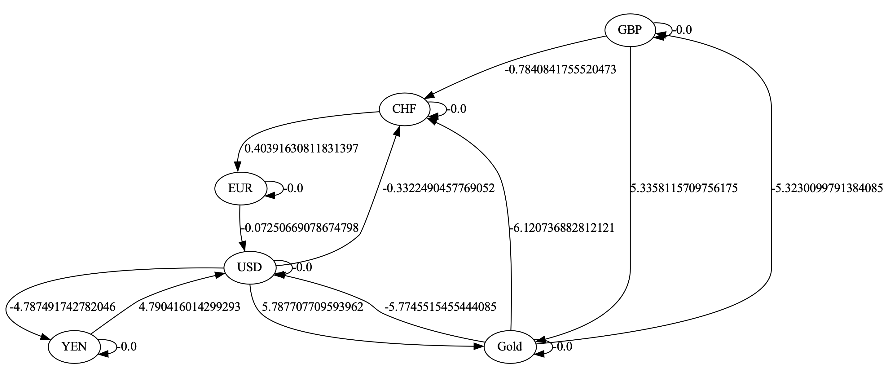

# Arbitrage Trading with Floyd-Warshall Algorithm

This repository contains an implementation of the Floyd-Warshall
Algorithm ([Wikipedia](https://en.wikipedia.org/wiki/Floyd%E2%80%93Warshall_algorithm)) to identify arbitrage
opportunities on foreign exchange markets.

Given a directed graph where nodes represent currencies and arc weights
represent exchange rates between two currencies, the goal is to identify cycles (a trading sequence) that yield a net profit.

Given a sequence of arcs that determine a cycle $C$, it has to hold that $\Pi_{c \in C} \ w_c > 1$ where $w_c$ is the arc weight of arc $c$.

Using the negative natural logarithm of arc weights, the stated condition can be reformulated as $\sum_{c \in C} -ln(w_c) < 0 $.

### Example

As an example, assume the following exchange rates between currency pairs:

|          | **GBP** | **EUR** | **YEN** | **CHF** | **USD**  | **GOLD** |
|----------|---------|---------|---------|---------|----------|----------|
| **GBP**  | 1       |         |         | 2.1904  |          | 0.004816 |
| **EUR**  |         | 1       |         |         | 1.0752   |          |
| **YEN**  |         |         | 1       |         | 0.008309 |          |
| **CHF**  |         | 0.6677  |         | 1       |          |          |
| **USD**  |         |         | 120     | 1.3941  | 1        | 0.003065 |
| **Gold** | 205     |         |         | 455.2   | 322      | 1        |

This leads to the following digraph (now using the negative natural logarithm of arc weights):

A trading sequence of $EUR \rightarrow USD \rightarrow CHF \rightarrow EUR$  leads to a net gain of around 0.0008397 EUR:

1.0752 * 1.3941 * 0.6677 = 1.0008397... > 1.

Compare also to the negative cycle in the modified digraph with the sum of arc weights = -0.000839428....

This also corresponds to our previously determined net gain: $e^{0.000839428} = 1.0008397$.

### Installation
The code requires the following Python modules to be installed:
- `openpyxl` for reading in the data from the provided excel-file (`arbitrage.xlsx`) 
- `graphviz` for the generation of the graph pdf-files.

See also `requirements.txt`.

### Code Execution
The code can be run via the ``main.py`` file.
